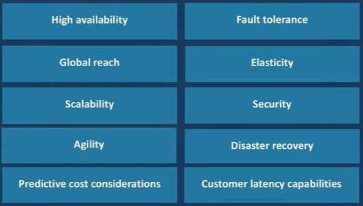

# AZ900 - Módulo 1
## O que é Nuvem ?
   Computação em nuvem é a entrega de serviços de computação por meio da internet, possibilitando uma inovação mais rápida, recursos flexíveis e economia de escala (O custo unitário tende a ficar mais barato dependendo do volume do negócio – Mais barato se levar mais).

## O que é Azure ?
## Serviços do Azure

## Modelos de Nuvem
### Public Cloud - Não significa que é gratis!
  * Fornece recursos e serviços para várias organizações e usuários.
  * Recursos compartilhados entre cliente.
  * Acesso via conexão de rede segura (geralmente pela internet).
  * Cada cliente tem acesso exclusivamente a sua informação, mas o hardware é compartilhado. 
  
### Private Cloud - Nuvem interna
  * Pertecente e operado pela organização que utiliza os recursos da nuvem.
  * Recursos somente da organização, assim, ela diferencia.
  * As organizações criam um ambiente de nuvem em seus datacenter.
  * Acesso de autoatendimento para calcular recursos fornecidos aos usuários dentro da organização.
  * Organizações responsáveis pela operação dos serviços que prestam.
Para ser uma nuvem, precisa ter as seguintes características:
* Auto provisionamento
* Bilhetagem - Valor gasto pelo consumo dos recursos

### Hybrid cloud - Mais utilizada
  * Interliga rede on-promise com a Azure
  * Combina nuvens públicas e privadas para permitir que os aplicativos sejam executados no local mais apropriado

## Benefícios de Cloud

### High Avaibility (Alta disponibilidade)
Recursos deve estar disponível.
### Fault Tolerance - Redundância
Compõe uma aplicação de modo que ela irá resistir a uma possível falha. 
### Global Reach (Alcance global)
A nuvem podem ser acessada e utilizada de qualquer lugar do mundo (mesmo que o loval não possua uma região)
### Elasticity (Elasticidade)
Provisionamento automático de acordo com a demanda necessária. 
### Scalability (Escalabilidade)
### Security (Segurança)
### Agility (Agilidade)
### Disaster Recovery (Recuperação de desastre)
Em caso de um desastre, é necessário ter uma replicação do ambiente.
### Predictive cost considerations (Considerações de custo preditivo)
É uma estimativa de custo
### Customers latency capabilities (Capacidade de latência do cliente)

## CapEx e OpEx
### Capital Expenditure (CapEx) - Compra de Hardware - On-premises
Gastar com inraestrutura física antecipadamente. Alto custo inicial, o valor de investimento reduz com o tempo.
Alto custo inicial, o valor do investimento reduz com o tempo.

### Operational Expenditure (OpEx)
Gastar em serviços ou produtos, conforme necessário.
Sem custo inicial, pague conforme o uso.

### No Azure usamos somente OpEx?
* Tem pontos particulares, como a instância reservada que pode ser definida por contrato, que é CapEx. 
* Pouquíssimos recursos usam CapEx.
      
Disaster Recovery vs. High Availability vs. Fault Tolerance
  Elasticity X Scalability: https://www.geeksforgeeks.org/scalability-and-elasticity-in-cloud-computing/
    
# Modelo baseado em consumo
* Sem custos iniciais
* Não há necessidade de comprar e gerenciar infraestrutura dispendisiosa
* Capacidade de pagar por recursos adicionais, conforme necessário
* Capacidade de parar de pagar por recursos que não são mais necessários.

**Observação:** Existem recursos que ao darmos stop, podemos parar de pagar. Contudo, também há recursos
que mesmo quando parados, ainda continuamos pagando. Exemplo: 
Após a criação e a utilização de uma máquina virtual, se desprovisinarmos/deletarmos ela. Ainda continuamos pagando pelo disco. 
Não é possível desprovisionar o disco porque as informações seriam perdidas. Assim, é necessário deletar o disco separadamente. 

# Modelos de Serviços
## Infraestructure as a Service (IaaS)
* A categoria mais básica de serviços de computação em Nuvem
* Construa infraestrutura de TI paga como você utilizar servidores, máquinas virtuais, armazenamento, redes e sistemas
operacionais de um provedor de nuvem.
* Infraestrutura de computação instantânea, provisionada e gerenciada pela internet.
Modelo onde tem a maior mão de obra, onde você é responsável por grande parte dos itens de manutenção:
* Instalar updates
* Configuração
* Atualização
* Manutenção
* Firewall
* Antivirus
* Backup do SO
IaaS -  Menor responsabilidade para o Provedor.

## Plataform as a Service (PaaS)
* Fornece ambiente para construção, testes e implementação de aplicativos de software.
* Ajuda a criar aplicativos rapidamente, sem se concentrar no gerenciamento de infraestrutura subjacente.
Exemplo: Imagine que desejamos utilizar um banco de dados.

  Em IaaS:
    * Podemos usar SQL Server, para isso, instalamos o SQL no Windows Server. Nesse modo, somos responsáveis por 
todo o gerenciamento do SO.

  Em PaaS:
    * Podemos configurar um SQL Database, assim, iremos gerenciar apenas o banco de dados (Acesso, dados). O provedor irá cuidar da 
infraestrutura e questões de disponibilidade.

## Software as a Service (SaaS)
* Software hospedado centralmente e gerenciado para usuários finais. Os usuários se conectam e usam aplicativos baseados em nuvem pela internet.
Por exemplo: Microsoft Office 365, e-mail e calendários.
* Onde há o mínimo possível de responsabilidade, só cuidamos dos dados, licença e acesso. 

# Responsabilidade compartilhada
FOTO: 55:41

A tabela abaixo mostra a responsabilidade:

**On-Premises: Tudo é sua responsabilidade**
## IaaS: 
* Não possui responsabilidade sobre Compute, Networking e Storage - Componentes físicos (Hardware *  Switch, Datacenter e discos). 
* Você é responsável pelo gerenciamento da máquina virtual, se tem update, aplicações instaladas, acesso e dados (backup).
## PaaS: 
* Não se preocupa com VM nem com SO. Somente com a aplicação, o acesso e os dados.
## SaaS:
* Só se preocupa com o Uso da aplicação (licenciamento e informações)

# Componentes arquitetura do Azure
## Regiões do Azure
* Há mais de 60 regiões 
* As regiões são compostas por um ou mais datacenters próximos.
* Fornece flexibilidade e escala para reduzir a latência do cliente.
* Preserva a residência de daos com uma oferta abrangente de conformidade.

**Observações:**
* Regiões anunciadas não significam que estão disponíveis
* Nem todos os recursos estão disponíveis para todas as regiões.
* Regiões tem preços diferentes

## Pares de regiões
FOTO: 1:02:40
* Toda região tem o seu par.
* É necessário pelo menos 300 milhas de separação entre pares de região.
* Replicação automática para alguns serviços
* Priorizar a recuperação da região em caso de paralisação
* As atualização são distribuídas sequencialmente para minimizar o tempo de inatividade.

**Observação:** 
* A segunda região do Brasil (Brazil Southeast - sudeste) está disponível apenas para alguns serviços, e ainda não é a região par da região Brazil South

# Opções de Alta disponibilidade
A Alta disponibilidade varia de acordo com o serviço, temos três possíveis (para a prova) disponibilidades:
* **SINGLE VM:** Modelo mais simples de SLA, possui disponibilidade de 99.9% (Período de 30 dias) se um disco Premium for usado. 
* **AVAILABILITY SETS:** Proteção contra falhas dentro do mesmo datacenter (mesma zona), não há replicação de máquina. Nesse modelo há um SLA de 99.95%
Exemplo: Pense em diferentes Racks em um mesmo datacenter.
* **AVAILABILITY ZONE:** Proteção contra falhas inteiras de um datacenter, é a opção com o maior SLA (99.99%).
É necessário pelomenos duas máquinas e duas zonas. 

**Observação:**  
* Não é cópia é distribuição física em máquinas. 

## Opção de Disaster Recovery:
* **MULTI REGION DISASTER RECOVERY:** Proteção regional dentro dos limites da residência de dados
Nesse modelo há a cópia da máquina de uma região para outra.

**Observações:**
* VM e Storage são as que mais caem em prova. 
* Se a Microsoft não cumprir com o SLA ela paga uma multa para você, sobre o valor de indisponibilidade. 

## Availability Set
Um Avalability Set é um agrupamento lógico de VMs que permite que o Azure entenda como o seu aplicativo foi criado para fornecer redundância 
e disponibilidade. Recomenda-se que duas ou mais VMs sejam criadas dentro de um availability set para fornecer um aplicativo altamente disponível
e para atender o SLA de 99,95% do Azure. Não há nenhum custo para o conjunto de disponibilidade em si, você paga apenas por cada instância de VM que criar.

Cada máquina virtual em seu availability set receberá um update domain (UD) e um fault domain (FD) da plataforma subjacente do Azure. Todas as máquinas
adicionadas a um availability set serão distribuídas de forma dividida entre cada UD e FD.

### UD E FD
FOTO: 1:11:40

Update domains (UD): As atualizações programadas de manutenção, desempenho ou segurança são sequenciadas através de domínios de atualização.

Fault domains (FD): Forneça uma separação física de cargas de trabalho em diferentes hardwares em um datacenter. 

UD: Conjuntos que garantem que as máquinas em um update domain, não esteja no mesmo hardware. Isso garante que a aplicação fica disponível 
caso uma atualização/manutenção de hardware seja necessária.

FD: É o mesmo caso do Update Domain, só que para falhas (não são programadas). 

## Availability Zone
* Uma zona de disponibilidade é uma zona fisicamente separada, dentro de uma região do Azure.
* Há três zonas de disponibilidade por região do Azure.

**Podemos pensar em ZONA como um datacenter.

# Sobre recursos
## Resource Group
Um resouce group é um contêiner para gerenciar e agregar recursos em uma única unidade. *  Organizar de forma lógica.
* Todo recurso deve estar associado a um grupo de recursos.
* Os recursos podem existir apenas em um grupo de recursos.
* Os recursos podem existir em diferentes regiões.
* Os recursos podem ser transferidos para diferentes grupos de recusos.
* Os aplicativos podem utilizar vários grupos de recursos.
* Os recursos podem se comunicar com recursos dentro de outros grupos de recursos.
* Podemos definir uma região para ele, mas podemos colocar recursos de outras regiões nele. 

**Observação:** 
* O resource group é um limitador lógico, não físico. 
* É comum a segmentação por ambiente, por recurso e por aplicação.

## Azure Resources
Os recursos do Azure são quasiquer tipos de serviços/componentes como armazenamento, máquinas virtuais e redes disponíveis para criar soluções em nuvem.
* VMs, App Services, Storage Accounts, Virtual Netowrks, App Services, SQL Databases e Functions.
FOTO: 1:18:20

# Gerenciamento
## Azure Subscriptions *  É onde todos os recursos são armazenados
Uma assinatura do Azure fornece acesso autenticado e autorizado às contas do Azure. 
* Limite de fatoramento: Gerar relatórios de faturamento separados e faturas para cada assinatura.
* Limite de controle de acesso: Gerenciar e controlar o acesso aos recursos que os usuários podem prover com assinaturas específicas. 
* É a sua conta, nele tem seus recursos, informações referentes ao faturamento/custos e consumo do ambiente da Azure.
* É o nível mais alto de gerenciamento, assim, os recursos herdam as características da subscription. 

**Observação:** 
* Para criar um recurso/Grupo de recurso no Azure é necessário que haja uma Subscription (Primeiro Item). 
* Podemos ter N Subscriptions dentro de um mesmo ambiente. Isso faz com que o gerenciamento seja mais fácil. 

## Management Groups
* Management Groups podem incluir várias assinaturas do Azure.
* As assinaturas herdam as condições aplicadas aos grupo de gerenciamento.
* Podem ser utilizados 10.000 management groups em um único diretório.
* Uma árvore de Management group pode suportar até seis níveis de profundidade.
* O permissionamento de um Management group é aplicado as subscriptions.

# Workloads/Tipos de serviços/Famílias de serviços
## Azure Compute Services
O Azure compute services é um serviço de computação sob demanda que fornece recursos de computação, como discos, processadores, memória, rede e sistemas 
operacionais. Como:
* Virtual Machines
* App Services 
* Container Instances
* Azure Kubernetes Services (AKS)
* Windows Virtual Desktop (Azure Virtal Desktop)

## Azure App Services
O Azure App Services é uma plataforma totalmente gerenciada para construir, implantar e dimensionar aplicativos web e APIs rapidamente.
* Compatível com .NET, .NET COre, Node.js, Java, Python ou PHP.
* PaaS oferecendo com requisitos de desempenho, segurança e conformidade de nível corporativo. 

## Azure Container Services 
Azure Containers são um ambiente virtualizado, leve e que não requer gerenciamento de sistemas operacionais e pode responder às mudanças sob demanda.
Temos dois tipos de containers no Azure:
* **Azure Container Instance:** Uma oferta Paas que executa um contêiner no Azure sem a necessidade de gerenciar uma máquina virtual ou serviços adicionais.
* **Azure Kubernetes Service:** Um serviço de orquestração para contêiners com arquiteturas distribuídas e grandes volumes de contêiners.
### VM X Container
VMs -  Cada máquina virtual possui o seu próprio sistema operacional.
Containers - Temos apenas um SO, e os containers compartilham ele. 
 
